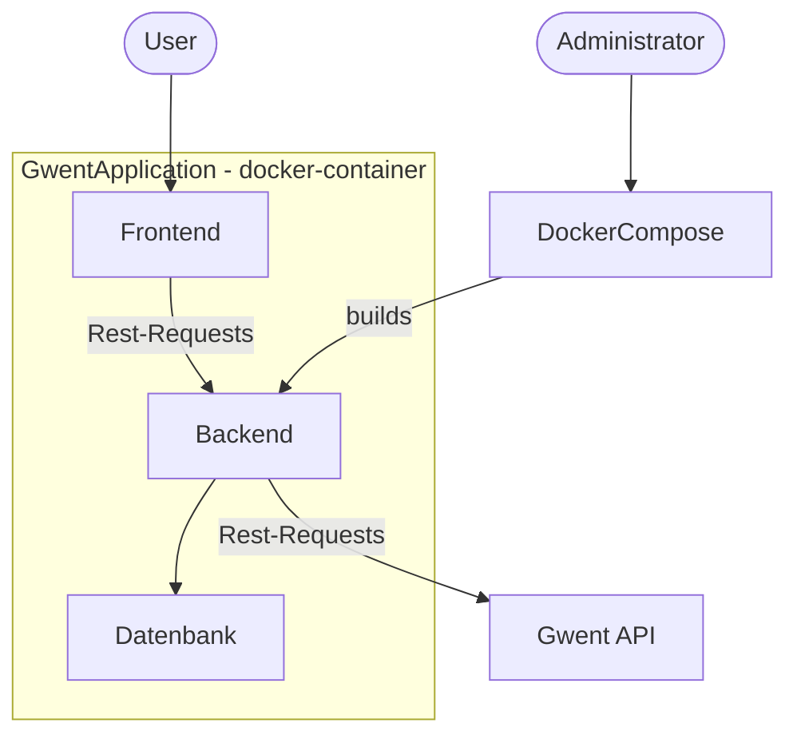

# Bausteinsicht

## Level 1 - Gesamtüberblick

```mermaid
graph TD

    %% Akteure
    User([User]) --> Frontend
    Administrator([Administrator]) --> DockerCompose

    %% Bausteine
    subgraph GwentApp [GwentApplication - docker-container]
        Frontend[Frontend]
        Backend[Backend]
        Datenbank[Datenbank]
    end

    %% Beziehungen zwischen Bausteinen
    Frontend -->|Rest-Requests| Backend
    Backend --> Datenbank
    Backend -->|Rest-Requests| GwentAPI[Gwent API]

    %% Infrastruktur
    DockerCompose -->|builds| Backend
    
```

