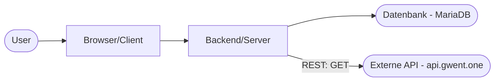

# Kontext

```mermaid
graph LR
    User([User]) --> Browser/Client
    Browser/Client --> Backend/Server
    Backend/Server --> Datenbank([Datenbank - MariaDB])
    Backend/Server --"REST: GET"--> Api([Externe API - api.gwent.one])


```
## Schnittstellen

MariaDB als persistenter Speicher

## Externe Systeme

https://api.gwent.one/ für die Kartendaten und die Bilder